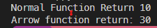

- [Javascript](#javascript)
  - [Javascript Basic](#javascript-basic)
    - [Way to see console log Javascript](#way-to-see-console-log-javascript)
    - [Variable Declare](#variable-declare)
    - [Data types](#data-types)
    - [Primitive](#primitive)
    - [String](#string)
        - [String type](#string-type)
      - [String Method](#string-method)
      - [Number type](#number-type)
      - [Boolean type](#boolean-type)
      - [Undefined type](#undefined-type)
      - [Null type](#null-type)
      - [Bigint type](#bigint-type)
      - [Symbol type](#symbol-type)
    - [Non primitive](#non-primitive)
      - [Object](#object)
      - [Array](#array)
        - [Concat two array](#concat-two-array)
        - [Array.prototype.splice()](#arrayprototypesplice)
    - [Operators](#operators)
    - [Function](#function)
      - [Function with and without return value](#function-with-and-without-return-value)
      - [Built in function](#built-in-function)
    - [Loops](#loops)
      - [For loops](#for-loops)
      - [While loops](#while-loops)
      - [Break and Continue](#break-and-continue)
    - [Type Conversion](#type-conversion)
      - [Implicit](#implicit)
      - [Explicit conversion](#explicit-conversion)
        - [Number to String Conversion](#number-to-string-conversion)
    - [Flow control](#flow-control)
      - [If-Else Method](#if-else-method)
- [ES6](#es6)
  - [Arrow Function](#arrow-function)
    - [Without Parameter](#without-parameter)
    - [Function With Parameter](#function-with-parameter)
  - [Truthy / Falsy values](#truthy--falsy-values)
    - [Ternary Operator](#ternary-operator)
    - [](#)
- [Prototype](#prototype)
  - [Inheritance](#inheritance)
    - [Inheritance  using Function](#inheritance--using-function)
    - [Class inheritance](#class-inheritance)
    - [Polymorphism](#polymorphism)


## Installation

```bash
npm create vite@latest
npm run dev
00-javascript-basic
# learn-markdown for code
```
# Javascript
## Javascript Basic
### Way to see console log Javascript 
* First developer mode web and go to console
* Vs code terminal node then js file name.
### Variable Declare
``` javascript
console.log("Hello World Bappy")
let age =25
age=30
console.log(age)
const salary=2500
// salary=4000 : error found
// Constant value not change
console.log(salary)
var PI=3.14
console.log(PI)
```

### Data types
### Primitive
### String
 ##### String type
  ```javascript 
  const name='Bappy'
  const language="Bangla"
  const channel=`code`
  console.log(name,language,channel)
var brand ="Amigoscode"
console.log(typeof brand)
console.log(brand.toUpperCase())
console.log(brand.substring(0, 6))
var a="Amigos"
var b="code"
console.log(a+" "+b)
console.log(`${a} ${b.toUpperCase(0,2)}`)
console.log(a.charAt(5))
console.log(a[5])
function areEqualCaseInsensitive(str1, str2) {
    if(str1.toUpperCase() === str2.toUpperCase())
    return str2
    else
    return false
  }
  
var a=areEqualCaseInsensitive("Bappy","bappy") 
console.log(a)
  ```
#### String Method

#### Number type
  ```javascript 
  const total=0
  var PI=3.14
  ```
#### Boolean type
   ```javascript 
  const isPrimaryNumber = true
  const isNewUser= false
  ```
#### Undefined type
   ```javascript 
  let result
  console.log(result)
  const res=undefined
  ```
#### Null type
   ```javascript 
  const res =null
  ```
#### Bigint type
   ```javascript 
  console.log(2 ** 53-1)
  console.log(Number.MAX_SAFE_INTEGER)

  let x=Number.MAX_SAFE_INTEGER

  console.log(x+1)
  console.log(x+10)
  // create a bigint number
  let xy= 211111111111111111n
  console.log(typeof(xy))
  // BigInt operation 
  let ab=10n
  let bc=20n
  console.log(ab+bc)
  console.log(bc-ab)
  // console.log(10+20n) not correct 
  ```
#### Symbol type
   ```javascript 
  
  ```
### Non primitive
#### Object
  ```javascript 
  
var person={

    firstName:'Borhan Uddin',
    lastName:'Bappy',
    age:26
}
console.log(person['lastName'])
// add value an object
person["mobileNumber"] = 1521788394
person.village="Banail"
console.log(person)
// delete element from object
delete person.lastName
console.log(person)
// empty Object create

var student = {}
student.name="bappy"
console.log(student)
var person = {
  firstname: 'Borhan',
  age: 21,
  isMale: true,
  balance: 100.0,
  dob: new Date(2000, 1, 28).toJSON(),
  address: { vill: 'Banail',
                city: 'tangail' 
              }
}
console.log(person)
console.log(person.age)
console.log(person.balance)
console.log(Object.values(person))
console.log(Object.keys(person));
console.log(JSON.stringify(person))
  ```
#### Array
  ```javascript
  console.log(name)
console.log(name[0])
console.log("index 0-"+name[0])
console.log("index 1-"+name[1])
console.log("index 2-"+name[2])
console.log("index 3-"+name[3])
console.log("index 4-"+name[4])
name.append=("Bappy")
console.log(name)
name.delete=("Bappy")
console.log(name)
console.log(name)
var years=[5,6]
console.log(years[0] !== years[1]);
years[5] = "mango";
console.log(years)
console.log(Object.keys(years))
```
##### Concat two array
```javascript
const array1=["a","b","c","d"];
const array2=["e","f","g","h"];
const array3=array1.concat(array2);
console.log(array3)
const letters=['a','b','c']
const lettersNumber =letters.concat(1,[2,3])
console.log(lettersNumber)

const num1 = [[1]];
const num2 = [2, [3]];

const numbers = num1.concat(num2);

console.log(numbers);
// results in [[1], 2, [3]]

// modify the first element of num1
num1[0].push(4);
console.log(num2[2])
// push array
num2.push("9")
console.log(numbers);
// results in [[1, 4], 2, [3]]
```
##### Array.prototype.splice()
``` javascript
const months = ['Jan', 'March', 'April', 'June'];
months.splice(1, 0,'Feb');
// Inserts at index 1
console.log(months);
// expected output: Array ["Jan", "Feb", "March", "April", "June"]

months.splice(4, 1, 'May');
// Replaces 1 element at index 4
console.log(months);
// expected output: Array ["Jan", "Feb", "March", "April", "May"]
months.splice(4, 1);
// Delete 1 element at index 4
console.log(months);
// expected output: Array ["Jan", "Feb", "March", "April"]
months.splice(4,0,'May')
// Inserts at index 4
console.log(months);
// expected output: Array ["Jan", "Feb", "March", "April", "May"]
```
### Operators
* Assignment operators
* Arithmetic Operators
* Comparison Operators (https://www.w3schools.com/js/js_comparisons.asp )
* Logical Operators
* String Operators
* Other Operators
### Function
#### Function with and without return value
``` javascript
function addumbers(number1,number2){
var addition =number1+number2;
console.log(addition);
}
addumbers(4,8);
addumbers(8,9);
//  Function call with return value
function addtwonumbers(number1,number2){
var addition =number1+number2;
return addition
}
var res1=addtwonumbers(4,8);
var res2=addtwonumbers(8,9);
console.log(res1,res2)

```
#### Built in function
```javascript
var person={
    name:'Shoab',
    age:23
}
console.log(Object.values(person))
console.log(Object.keys(person))
console.log("shoab".toLowerCase())
console.log("shoab".toUpperCase())
//  Here b find index 4
console.log("shoab".indexOf("b"))
console.log("shoab".indexOf("a"))
```

### Loops
#### For loops
```javascript
var names=[
    'Shoab',
    'Borhan',
    'Sharukh',
    'Ariful'
]
console.log("fori")
for(var i=0;i<names.length;i++){
    console.log(names[i])
}
console.log("")
console.log("for of")
// for (const iterator of object) {
   
// }
for (const name of names) {
    console.log(name)
}
console.log("")
console.log("forEach")
// array.forEach(element => {
  
// });

names.forEach(function(name) {
    console.log(name)
});
console.log("")
console.log("For loop ")
for (let index = 0; index < names.length; index++) {
    const element = names[index];
    console.log(element)
}
```
#### While loops
```javascript
var number =0;
while (number<5){
    console.log(number);
    number=number+1
}
var condition=true
while(condition){
    console.log('Hello')
    condition=false
}
var index=0
while(index<names.length){// condition
    console.log(names[index])
    index=index+1
}

do{
    console.log("hello")
}while(false)
```
#### Break and Continue
```javascript
for(var a=0;a<=10;a++){
    console.log(a);
    if(a==5){
        break;
    }
}
for(var a=0;a<=10;a++){
    if(a==5){
        continue;
    }
    console.log(a);

}
```
### Type Conversion
#### Implicit 
* In certain situations, JavaScript automatically converts one data type to another (to the right type). This is known as implicit conversion.

```javascript
// numeric string used with + gives string type
let result;

result = '3' + 2; 
console.log(result) // "32"
console.log(typeof(result))
// Note: Here Number is automatically convert String
result = '3' + true; 
console.log(result); // "3true"
// Note: Here boolean is automatically convert String because first word are 

result = '3' + undefined; 
console.log(result); // "3undefined"
// Note: Here keywords is automatically convert String because first word are 
result = '3' + null; 
console.log(result); // "3null"

// numeric string used with - , / , * results number type

let result;

result = '4' - '2'; 
console.log(result); // 2
// String automatically convert  integer
result = '4' - 2;
console.log(result); // 2

result = '4' * 2;
console.log(result); // 8

result = '4' / 2;
console.log(result); // 2
```
#### Explicit conversion
* You can also convert one data type to another as per your needs. The type conversion that you do manually is known as explicit type conversion.
* In JavaScript, explicit type conversions are done using built-in methods.
```javascript
var result;

// string to number
result = Number('324');
console.log(result); // 324


```
##### Number to String Conversion 
* String literal -> str = "" + num + "";
* String constructor -> str = String(num);
* toString -> str = num.toString();
* String Literal simple -> str = "" + num

```JavaScript
// In JavaScript, empty strings and null values return 0. For example,
var result;
result = Number(null);
console.log(result);  // 0

// If a string is an invalid number, the result will be NaN. For example,

var result = Number('hello');
console.log(result); // NaN
// You can also generate numbers from strings using parseInt(),
// parseFloat(), unary operator + and Math.floor(). For example,
 result;
result = parseInt('20.01');
console.log(result); // 20

result = parseFloat('20.01');
console.log(result); // 20.01

result = '20.01';
console.log(result); // 20.01

result = Math.floor('20.01');
console.log(result); // 20
// https://www.programiz.com/javascript/type-conversion link
```
### Flow control
```javascript
```
#### If-Else Method

# ES6
## Arrow Function
### Without Parameter
```JavaScript 
// Normal Function 
function numbers(){
  return 10;
}
console.log(`Normal Function Return: ${numbers()}`);
let number=()=> 30
// Arrow Function
let number=()=> 30
console.log(`Arrow function return: ${number()}`)
```
 Output of  Arrow Function 


### Function With Parameter
## Truthy / Falsy values 


```JavaScript 
var maybar= 0;
if(maybar){
    console.log("I am truthy")
} else{
    console.log("I am Falsy")
}
// Expected Result is I am Falsy, 0,Null,"", Undefined always return else

```
### Ternary Operator
```JavaScript 
var age = 8;
// var type=(age>=18) ? "adult" : "Child"
var type = age >= 18 ? "adult" : age < 10 ? "child" : "Young";
// var type=age>6
console.log(type);
```
### 
```JavaScript 

```

```JavaScript 

```
```JavaScript 

```
# Prototype
```JavaScript 

let person={

}
person.name='Sakib khan';
person.age=18;
person.eat=function(){
    console.log('Person is eating')
};
person.sleep=function(){
    console.log('Person is sleeping')
}
console.log(person)
// In this code problem occur every time object create like person1,person2
// Resolve this issue using function with parameter.

function Person1(name,age){
    let person1={}
    person1.name=name
    person1.age=age
    person1.eat=function(){
        console.log('Person is eating')
    };
    person1.sleep=function(){
        console.log('Person is sleeping')
    }
   return person1;
}
let sakib1=Person1('Sakib', 36)
let tamim1=Person1('Tamim',34)
console.log(sakib1)
sakib1.eat()

// Here is problem general property  crate every time so, we solve this issue using crate a object outside the person function
// and call Her

const persomethod={

    eat(){
        console.log('Person is eating')
    },
   sleep(){
        console.log('Person is sleeping')
    },
    play(){
        console.log('Person is Playing')
    }
};  


function Person2(name,age){
    let person2={}
    person2.name=name
    person2.age=age
    person2.eat=persomethod.eat;
    person2.sleep=persomethod.sleep;
    person2.play=persomethod.play;

   return person2;
}
let sakib2=Person2('Sakib', 36)
let tamim2=Person2('Tamim',34)
console.log(sakib2)
sakib2.play()

// if you want to common function you add two time object.create method solve this issue
const persomethods={

    eat(){
        console.log('Person is eating')
    },
   sleep(){
        console.log('Person is sleeping')
    },
    play(){
        console.log('Person is Playing')
    }
};  


function Person3(name,age){
    let person3=Object.create(persomethods)
    person3.name=name
    person3.age=age

   return person3;
}
let sakib3=Person3('Sakib', 36)
let tamim3=Person3('Tamim',34)
console.log(sakib3)
sakib3.play()

 
// Prototype is function property which point out JavaScript object.

function Person4(name,age){
    this.name=name
    this.age=age

}
Person4.prototype = {

    eat(){
        console.log('Person is eating')
    },
   sleep(){
        console.log('Person is sleeping')
    },
    play(){
        console.log('Person is Playing')
    }
};  
// Using New we can remove object.crate and return that autometicly count prototype.

let sakib4=new Person4('Sakib', 36)
let tamim4=new Person4('Tamim',34)
console.log(sakib4)
sakib4.play()


// function Person(name, age,phonenumber) {
//   this.name = name;
//   this.age = age;
//   this.phonenumber=phonenumber;
// };

// Person.prototype = {
//   eat() {
//     console.log("Person is eating");
//   },
//   sleep() {
//     console.log("Person is sleeping");
//   },
//   play() {
//     console.log("Person is Playing");
//   }
// };
// let sakib = new Person("Sakib", 36,'01778122843');
// let tamim = new Person("Tamim", 34,'01767416203');
// console.log(sakib);
// sakib.play()

// let sakib = new Personwithnew("Sakib", 36);
// let tamim = new Personwithnew("Tamim", 34);
// sakib.play();

// Using Class in this point eat() is method here not object 
class Person5{
   constructor (name, age,phonenumber) {
    this.name = name;
    this.age = age;
    this.phonenumber=phonenumber;
  }
  
    eat() {
      console.log("Person is eating");
    }
    sleep() {
      console.log("Person is sleeping");
    }
    play() {
      console.log("Person is Playing");
    }
  };
  let sakib5 = new Person5("Sakib", 36,'01778122843');
  let tamim5 = new Person5("Tamim", 34,'01767416203');
  console.log(sakib5);
  sakib5.play()
```

## Inheritance  


```javascript
function Person(name, age) {
        this.name = name;
        this.age = age;

    }

Person.prototype={
    eat:function(){
        console.log(`${this.name} is eating`)
    }
}
const sakib=new Person("Sakib",35);
console.log(sakib)
const tamim=new Person("Tamim",34);
console.log(tamim)
```
// Here used prototype for memory efficiency

### Inheritance  using Function


```javascript
function Person(name, age) {
        this.name = name;
        this.age = age;

    }

 function Cricketer(name,age,type,country){

    Person.call(this);
    this.name=name;
    this.age=age
    this.type=type;
    this.country=country;
 }
Person.prototype={
    eat:function(){
        console.log(`${this.name} is eating`)
    }
}
Cricketer.prototype=Object.create(Person.prototype);
Cricketer.prototype.constructor=Cricketer;
Cricketer.prototype.play=function(){
    console.log(`${this.name} is Playing`)
}
let sakib=new Cricketer("Sakib",35);
sakib.play()
```

### Class inheritance

```javascript
class Person {
  //Parent Class
  constructor(name, age) {
    this.name = name;
    this.age = age;
  }
  eat() {
    console.log(`${this.name} is eating`);
  }
}
class Cricketer extends Person {
  //Sub Class
  constructor(name, age, type, country) {
    super(name, age);
    this.name = name;
    this.age = age;
    this.type = type;
    this.country = country;
  }
  play() {
    console.log(`${this.name} is Playing`);
  }
}
let sakib = new Cricketer("sakib", 36, "Allrounder", "Bangladesh");
sakib.eat();


Getter nad Setter

class Person{
    constructor(name,age){
        this.name=name;
        this.age=age;
    }
    eat(){
        console.log(`${this.name} is eating`)
    }
    get setName(){
        return this.name;
    }
}
let sakib = new Person("sakib", 36 );
```

### Polymorphism


```javascript
class Person {
  //Parent Class
  constructor(name, age) {
    this.name = name;
    this.age = age;
  }
  eat() {
    console.log(`${this.name} is eating`);
  };
  play() {
    console.log(`${this.name} is Playing`);
  }

}
class Cricketer extends Person {
  //Sub Class
  constructor(name, age, type, country) {
    super(name, age);
    this.name = name;
    this.age = age;
    this.type = type;
    this.country = country;
  }
//   play() {
//     console.log(`${this.name} is Playing Cricket`);
//   }
play(){
    super.play();
        console.log(`${this.name} is Playing Cricket`);

}
}
let sakib = new Cricketer("sakib", 36, "Allrounder", "Bangladesh");
sakib.play();
```
